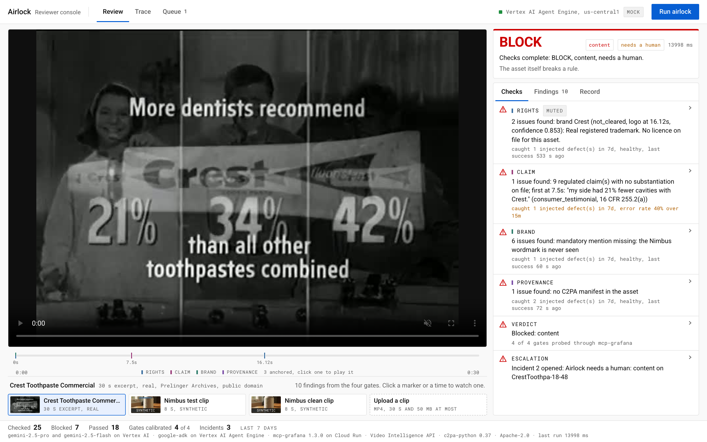

# Airlock

Studios ship dozens of generated assets a week, and nobody can prove which one was checked, by
which rule, and whether the check itself was working. Airlock answers one question per asset:
can this ship, on what proof, and was the control that said so in a state to say it?

Try it, no login: https://airlock-console-771466810465.us-central1.run.app (pick an asset, run the airlock, read the trace; the two demo assets and a clean one that PASSes, or upload a 30 s clip).




Public dashboard (no login): https://narrowsubmarine1895.grafana.net/public-dashboards/97860661238c4536a743e0d858aef845

## What it does

Four gates read the asset, each against a named source of truth:

| gate | source of truth | what blocks |
|---|---|---|
| rights | Video Intelligence API (logos, faces, text, explicit content) against `rights-registry.yaml` | an identifiable brand or face the registry does not clear |
| claim | gemini-2.5-pro extracts every claim with timestamps; 16 CFR Part 255 and two ASA rulings map each kind (`rules/`) | a regulated claim with no substantiation on file |
| brand | gemini-2.5-flash reads the asset against `charter.yaml` | a missing wordmark, an exclusion, a forbidden colour, the wrong tone |
| provenance | c2pa-python verifies the C2PA manifest against `trust/trust-anchors.pem` | no manifest, a broken signature, an untrusted signer |

Then the verdict agent asks Grafana, through MCP, four PromQL questions about each gate before it
rules: error rate over 15 minutes, seconds since the last success, injected defects caught over 7
days, and whether the last calibration run caught its defect. Two rules, both plain Python:

- **R1, control unavailable.** A gate with errors in the window, or whose last success Grafana
  cannot see within 15 minutes, forces BLOCK. The gate's own PASS does not count; Grafana's view of
  it does.
- **R2, uncalibrated.** A gate that has caught no injected defect, or whose last calibration run
  missed, is advisory: its PASS cannot contribute to a PASS verdict.

The verdict is written back to Grafana as an annotation. When only a human can lift the BLOCK (a
control in a bad state, or missing paperwork such as a substantiation, a licence, a release), the
escalation agent opens a Grafana incident. On the free stack the incidents are opened as drills
(`AIRLOCK_INCIDENT_DRILL`, `true` unless set to `false` in the Agent Engine env): they are real
Grafana Incident objects, flagged so a judge's runs do not pile up as production incidents.

Where the decisions live: the verdict rules, the escalation rule, the rights rule and the provenance
rule are plain functions under pytest on inputs a service measured (Video Intelligence annotations,
a C2PA validation). The claim and brand gates decide on labels the model produced under a JSON
schema (the kind of each claim and its quote; whether the wordmark was seen, the dominant colours,
the tone words): the rule that turns those labels into a BLOCK is a plain function, the labels are
the model's, so a wrong label is a wrong decision. ADK is the runtime envelope; Grafana is asked
before every verdict.

## Run it

```
uv sync                                                  # Python 3.12, google-adk, c2pa-python, Video Intelligence, google-genai
scripts/fetch_assets.sh                                  # the Prelinger commercial and the ten eval excerpts (public domain), hash checked
uv run pytest -q                                         # the rules and the eval scoring, no cloud needed
scripts/with_env.sh uv run python -m airlock.run assets/real/CrestToothpa-18-48.mp4      # the four gates, locally
scripts/with_env.sh uv run adk run agents/pipeline "gs://<your bucket>/asset.mp4"         # the whole pipeline, verdict through Grafana
```

`scripts/with_env.sh` loads `.env.local` (copy `.env.example`) and pulls the four secrets from the
macOS keychain of the author's account. On another machine skip it and export them yourself before
the command: `GRAFANA_SERVICE_ACCOUNT_TOKEN` (a Grafana service account token with editor rights),
`GRAFANA_INFLUX_TOKEN` and `GRAFANA_LOKI_TOKEN` (the stack's write token, the same value for both
on Grafana Cloud) and `AIRLOCK_MCP_TOKEN` (the bearer you give mcp-grafana). In the cloud they come
from Secret Manager (`infra/gcp/secrets.sh`).

What a judge changes to run it on their own project, all read from env with the author's values as
defaults: the project (`GOOGLE_CLOUD_PROJECT` in `.env.local`, `AIRLOCK_PROJECT` for the scripts
and in `agents/pipeline/.agent_engine_config.json`; `infra/gcp/bootstrap.sh` also takes
`AIRLOCK_BILLING` and `AIRLOCK_ACCOUNT`), the assets bucket (`AIRLOCK_ASSETS_BUCKET`, default
`airlock-agentic-cinema-assets`), the deployed engine (`AGENT_ENGINE_RESOURCE`, the resource name
`adk deploy` prints), the Grafana stack (`GRAFANA_URL`; `GRAFANA_INFLUX_URL` and
`GRAFANA_INFLUX_USER`, `GRAFANA_LOKI_URL` and `GRAFANA_LOKI_USER`: the push URLs and numeric
instance ids from the stack's Prometheus and Loki "Details" pages, in `.env.local` and in the same
config file) and the mcp-grafana URL (`AIRLOCK_MCP_URL`, printed by `infra/mcp-grafana/deploy.sh`).
The cloud side, in order: `infra/gcp/bootstrap.sh`, `infra/gcp/secrets.sh`,
`infra/mcp-grafana/deploy.sh`, `scripts/grafana_bootstrap.py`, then
`uv run adk deploy agent_engine --project <p> --region us-central1 --display_name airlock agents/pipeline`.
Every step and its output is in `docs/RUNS.md`.

## Architecture

```
  console (Next.js on Cloud Run)  ---- :streamQuery ---->  Vertex AI Agent Engine
    pick an asset, run, read the trace                       ADK SequentialAgent "airlock"
                                                               ParallelAgent "gates"
                                                                 rights      Video Intelligence + registry
                                                                 claim       gemini-2.5-pro + 16 CFR 255 + ASA
                                                                 brand       gemini-2.5-flash + charter
                                                                 provenance  c2pa-python + trust list
                                                               verdict   --McpToolset (streamable HTTP)-->  mcp-grafana on Cloud Run
                                                               escalation                                     |
                                                                                                              v
  gates push counters (Influx line protocol) and events (Loki)  ---->  Grafana Cloud: dashboard "Airlock gates",
                                                                        annotations, incidents
```

Inputs: a Prelinger commercial (real, public domain, `assets/real/SOURCE.md`), a Veo clip with an
injected claim and a real C2PA manifest (synthetic, labelled, `SYNTHETIC.md`), or a short upload.

ADK note: `SequentialAgent` and `ParallelAgent` are marked deprecated in google-adk 2.8.0 in favour
of `Workflow` (pytest prints the two warnings). `Workflow` is a graph node, not a `BaseAgent`, and
Agent Engine's `AdkApp` takes a `BaseAgent` as its root, so the pipeline stays on the two agents
until `Workflow` can be deployed as the root.

## Calibration

`python -m airlock.calibrate` runs one real injected defect per gate through the real gate and
pushes the catch or the miss to Grafana. The ledger of 2026-08-28:

| gate | injected defect | caught | missed |
|---|---|---|---|
| rights | a real trademark the registry does not clear, real faces without a release | 1 | 0 |
| claim | an expert endorsement with nothing behind it (16 CFR 255.3) | 2 | 2 |
| brand | a pure red urgency banner the charter forbids | 1 | 0 |
| provenance | the manifest stripped; a signed copy with one byte flipped | 2 | 0 |

The two claim misses are real: one was a bug on GCS-only assets (fixed the same hour), the other
was `--defect-removed`, the deliberate miss that shows the verdict refusing a PASS from a gate whose
last calibration failed (`docs/RUNS.md`, verification C).

Since 2026-09-02 the control proves itself on a schedule: a Cloud Run job (`python -m
airlock.daily_proof`, `infra/gcp/daily_proof.sh`) runs the full calibration and then the clean clip
through the deployed pipeline at 00:00 and 12:00 UTC, and pushes `airlock_daily_proof_total` with the
outcome. A failed proof is not retried into a pass: the gate that missed loses its right to PASS on
its own until a calibration catches again, and every run in between is a BLOCK "uncalibrated control".

## The console

`console/`: Next.js on Cloud Run, one screen, the light palette and type of YouTube Studio, no
animation. The clip is the stage (it plays while the gates read it) with every timestamped finding
marked on the scrubber, Frame.io style; beside it the verdict, then a segmented control: Checks (one
status line per gate, YouTube Studio's Checks step, the calibration line read from Grafana under
each and a "mute telemetry" switch inside the row to disable a gate and watch the verdict refuse),
Findings (the thread, a click on a time seeks the clip) and Record (the rules cited, the C2PA line,
the annotation and the incident). Two more views: the Trace (raw agent events) and the BLOCK queue.
Lighthouse on the hosted URL: accessibility 100. Mock mode
(`AIRLOCK_MOCK=1`) replays recorded runs so it builds and runs without a credential
(`console/README.md`).

## The gates as MCP tools

`airlock_mcp/`: a FastMCP server on Cloud Run (https://airlock-mcp-771466810465.us-central1.run.app/mcp,
bearer required) exposing `check_rights`, `check_claim`, `check_brand`, `check_provenance`,
`check_all`, `verdict_rules` and `list_rules`, so another agent can run a gate on a GCS asset and
read the rules the verdict will apply. Client, connection snippets and deploy: `docs/AIRLOCK-MCP.md`.

## Evaluation

`scripts/eval_gates.py` runs the four gates on 16 assets, one at a time: 10 more Prelinger
commercials (Cheerios, Chevrolet, Ivory, Kodak, Folgers, Labatt's, Gilbert, Macleans, Scotties,
General Electric; `assets/real/eval/SOURCE.md`, fetched and cut by `scripts/fetch_assets.sh`) and
the 6 synthetic clips. The ground truth is `eval/manifest.yaml`: the expected status per gate, the
rule ids that must fire and must not fire on each asset, and for the real spots the brand on screen
and whether a person is on screen (hand-labelled from contact sheets). A percentage never travels
without its count. `eval/EVAL.md`, run of 2026-09-05:

| gate | n | precision | recall | median latency | max |
|---|---|---|---|---|---|
| rights | 16 | 100% (10 of 10) | 100% (10 of 10) | 41.1 s | 94.5 s |
| claim | 5 | 100% (3 of 3) | 100% (3 of 3) | 20.7 s | 40.6 s |
| brand | 6 | 100% (2 of 2) | 100% (2 of 2) | 14.7 s | 22.0 s |
| provenance | 16 | 100% (14 of 14) | 100% (14 of 14) | 2 ms | 52 ms |

That is the status. Scored per rule, where a forbidden rule that fires is a false positive even when
the BLOCK was right, the same run reads:

| rule | gate | n | precision | recall |
|---|---|---|---|---|
| `registry:brands:unknown` | rights | 16 | 100% (9 of 9) | 90% (9 of 10) |
| `registry:faces:no_release` | rights | 16 | 100% (7 of 7) | 100% (7 of 7) |
| `registry:explicit_content` | rights | 16 | 0% (0 of 1) | n/a (0 of 0) |
| `16 CFR 255.3` | claim | 4 | 100% (3 of 3) | 100% (3 of 3) |
| `charter:mandatory_mentions` | brand | 6 | 100% (1 of 1) | 100% (1 of 1) |
| `charter:exclusions`, `charter:palette` | brand | 5 | 100% (1 of 1) | 100% (1 of 1) |
| `airlock:provenance:manifest-required` | provenance | 16 | 100% (12 of 12) | 100% (12 of 12) |
| `airlock:provenance:signature-valid` | provenance | 4 | 100% (1 of 1) | 100% (1 of 1) |
| `airlock:provenance:signer-trusted` | provenance | 3 | 100% (1 of 1) | 100% (1 of 1) |

Brand identification, scored apart from the BLOCK: the rights gate named the brand on screen on 4 of
10 real spots (40%). The BLOCK held on all ten because the policy blocks any brand the registry does
not know; a rights desk would still need the name.

Cost at list price (`pricing.yaml`, Billing Catalog SKUs read 2026-08-29): median 0.52 USD per
30 s spot (n=16), 8.23 USD for the whole run (16 Video Intelligence minutes, 32 Gemini calls); the
Video Intelligence started minute is most of it, so an 8 s clip costs the same as a 30 s one.

What the status score hid, kept in `eval/EVAL.md` under "Surprises": Video Intelligence named the
wrong company on 6 of the 10 real spots at high confidence (a 1955 Chevrolet read as "DeLorean Motor
Company", Kodak as "Stanley Steemer"), so the gate's reason says "a logo the registry does not know"
and quotes the API's guess as a guess; on Macleans it found no logo at all and the BLOCK rests on
the ten unreleased face tracks alone (the brand rule's recall, 9 of 10); it flags the 1963 Kodak
Instamatic family party as explicit content (VERY_LIKELY on 1 frame of 28, the policy blocks at
LIKELY), a false positive a status-only score would count as a correct BLOCK, reproduced on both
runs (2026-08-29 and 2026-09-05). And the raw Veo output is not unsigned: it carries a Google-issued
C2PA manifest, which the gate blocks as an untrusted signer until the studio puts Google's
certificate on its trust list.

## What is proven, and where

`docs/RUNS.md` carries every milestone with its command, output, annotation id and incident id:
the Agent Engine run of the real clip (BLOCK on content, annotation 9, incident 6), the run with
the rights telemetry dark for 16 minutes (BLOCK, control unavailable, annotation 7), the run after
a calibration miss (BLOCK, uncalibrated control, annotation 8), and the first PASS (annotation 10).

## Tests

`uv run pytest -q`: the line-protocol formatter, the four gate decisions, the verdict rules (R1,
R2, instrument error, paperwork escalation), the ledger's coverage of every gate. No test calls a
model or a cloud API.

## Synthetic inputs

`SYNTHETIC.md` names every synthetic element: the Veo clip, its overlays, its self-issued signing
certificate, the calibration variants. Everything else is real and named at its source.

## Layout

- `airlock/` gates, verdict rules, calibration ledger, telemetry push, the Grafana MCP toolset
- `agents/pipeline/` the ADK pipeline; `agents/spike/` the M1 spike (one PromQL, one annotation)
- `console/` the reviewer console (Next.js); `airlock_mcp/` the gates as MCP tools; `infra/` Google Cloud, Cloud Run and Secret Manager scripts
- `rules/` 16 CFR 255 and the ASA rulings; `charter.yaml`, `rights-registry.yaml`, `trust/`
- `scripts/` Grafana bootstrap, asset build, Agent Engine query; `tests/`; `docs/RUNS.md`

Built for Agentic Cinema (Google Cloud, Grafana Labs track), 2026-08-28 to 2026-09-09, by Dylan
Merigaud. Apache-2.0.
