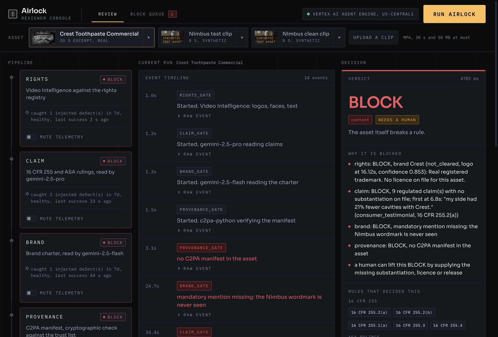
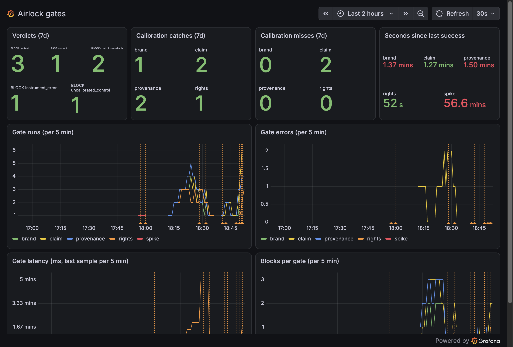

# Airlock

Studios ship dozens of generated assets a week, and nobody can prove which one was checked, by
which rule, and whether the check itself was working. Airlock answers one question per asset:
can this ship, on what proof, and was the control that said so in a state to say it?

Try it, no login: https://airlock-console-771466810465.us-central1.run.app (pick an asset, run the airlock, read the trace; the two demo assets and a clean one that PASSes, or upload a 30 s clip).





Public dashboard (no login): https://narrowsubmarine1895.grafana.net/public-dashboards/97860661238c4536a743e0d858aef845

## What it does

Four gates read the asset, each against a named source of truth:

| gate | source of truth | what blocks |
|---|---|---|
| rights | Video Intelligence API (logos, faces, text, explicit content) against `rights-registry.yaml` | an identifiable brand or face the registry does not clear |
| claim | gemini-2.5-pro extracts every claim with timestamps; 16 CFR Part 255 and two ASA rulings map each kind (`rules/`) | a regulated claim with no substantiation on file |
| brand | gemini-2.5-flash reads the asset against `charter.yaml` | a missing wordmark, an exclusion, a forbidden colour, the wrong tone |
| provenance | c2pa-python verifies the C2PA manifest against `trust/trust-anchors.pem` | no manifest, a broken signature, an untrusted signer |

Then the verdict agent asks Grafana, through MCP, four PromQL questions about each gate before it
rules: error rate over 15 minutes, seconds since the last success, injected defects caught over 7
days, and whether the last calibration run caught its defect. Two rules, both plain Python:

- **R1, control unavailable.** A gate with errors in the window, or whose last success Grafana
  cannot see within 15 minutes, forces BLOCK. The gate's own PASS does not count; Grafana's view of
  it does.
- **R2, uncalibrated.** A gate that has caught no injected defect, or whose last calibration run
  missed, is advisory: its PASS cannot contribute to a PASS verdict.

The verdict is written back to Grafana as an annotation. When only a human can lift the BLOCK (a
control in a bad state, or missing paperwork such as a substantiation, a licence, a release), the
escalation agent opens a Grafana incident.

Every decision is a plain function under pytest; the models only read. ADK is the runtime
envelope; Grafana is asked before every verdict.

## Run it

```
uv sync                                                  # Python 3.12, google-adk, c2pa-python, Video Intelligence, google-genai
scripts/fetch_assets.sh                                  # the Prelinger commercial (public domain), hash checked
uv run pytest -q                                         # the rules, 41 tests, no cloud needed
scripts/with_env.sh uv run python -m airlock.run assets/real/CrestToothpa-18-48.mp4      # the four gates, locally
scripts/with_env.sh uv run adk run agents/pipeline "gs://<your bucket>/asset.mp4"         # the whole pipeline, verdict through Grafana
```

`scripts/with_env.sh` loads `.env.local` (copy `.env.example`) and pulls the secrets from the macOS
keychain; in the cloud they come from Secret Manager. The cloud side, in order:
`infra/gcp/bootstrap.sh`, `infra/gcp/secrets.sh`, `infra/mcp-grafana/deploy.sh`,
`scripts/grafana_bootstrap.py`, then `uv run adk deploy agent_engine --project <p> --region us-central1 --display_name airlock agents/pipeline`.
Every step and its output is in `docs/RUNS.md`.

## Architecture

```
  console (Next.js on Cloud Run)  ---- :streamQuery ---->  Vertex AI Agent Engine
    pick an asset, run, read the trace                       ADK SequentialAgent "airlock"
                                                               ParallelAgent "gates"
                                                                 rights      Video Intelligence + registry
                                                                 claim       gemini-2.5-pro + 16 CFR 255 + ASA
                                                                 brand       gemini-2.5-flash + charter
                                                                 provenance  c2pa-python + trust list
                                                               verdict   --McpToolset (streamable HTTP)-->  mcp-grafana on Cloud Run
                                                               escalation                                     |
                                                                                                              v
  gates push counters (Influx line protocol) and events (Loki)  ---->  Grafana Cloud: dashboard "Airlock gates",
                                                                        annotations, incidents
```

Inputs: a Prelinger commercial (real, public domain, `assets/real/SOURCE.md`), a Veo clip with an
injected claim and a real C2PA manifest (synthetic, labelled, `SYNTHETIC.md`), or a short upload.

## Calibration

`python -m airlock.calibrate` runs one real injected defect per gate through the real gate and
pushes the catch or the miss to Grafana. The ledger of 2026-08-28:

| gate | injected defect | caught | missed |
|---|---|---|---|
| rights | a real trademark the registry does not clear, real faces without a release | 1 | 0 |
| claim | an expert endorsement with nothing behind it (16 CFR 255.3) | 2 | 2 |
| brand | a pure red urgency banner the charter forbids | 1 | 0 |
| provenance | the manifest stripped; a signed copy with one byte flipped | 2 | 0 |

The two claim misses are real: one was a bug on GCS-only assets (fixed the same hour), the other
was `--defect-removed`, the deliberate miss that shows the verdict refusing a PASS from a gate whose
last calibration failed (`docs/RUNS.md`, verification C).

## The console

`console/`: Next.js on Cloud Run. One page: the asset picker (two demo assets, a clean signed clip
that PASSes, an upload), the pipeline column (one card per gate with its source of truth, status
and calibration line read from Grafana, a "mute telemetry" switch to disable a gate and watch the
verdict refuse), the event timeline with the raw agent events, the verdict card with the reasons
and the rules cited, the stat tiles and the spec strip, and a BLOCK queue tab. Mock mode
(`AIRLOCK_MOCK=1`) replays recorded runs so it builds and runs without a credential
(`console/README.md`). Lighthouse on the hosted URL: accessibility 95, best practices 100.

## The gates as MCP tools

`airlock_mcp/`: a FastMCP server on Cloud Run (https://airlock-mcp-771466810465.us-central1.run.app/mcp,
bearer required) exposing `check_rights`, `check_claim`, `check_brand`, `check_provenance`,
`check_all`, `verdict_rules` and `list_rules`, so another agent can run a gate on a GCS asset and
read the rules the verdict will apply. Client, connection snippets and deploy: `docs/AIRLOCK-MCP.md`.

## What is proven, and where

`docs/RUNS.md` carries every milestone with its command, output, annotation id and incident id:
the Agent Engine run of the real clip (BLOCK on content, annotation 9, incident 6), the run with
the rights telemetry dark for 16 minutes (BLOCK, control unavailable, annotation 7), the run after
a calibration miss (BLOCK, uncalibrated control, annotation 8), and the first PASS (annotation 10).

## Tests

`uv run pytest -q`: the line-protocol formatter, the four gate decisions, the verdict rules (R1,
R2, instrument error, paperwork escalation), the ledger's coverage of every gate. No test calls a
model or a cloud API.

## Synthetic inputs

`SYNTHETIC.md` names every synthetic element: the Veo clip, its overlays, its self-issued signing
certificate, the calibration variants. Everything else is real and named at its source.

## Layout

- `airlock/` gates, verdict rules, calibration ledger, telemetry push, the Grafana MCP toolset
- `agents/pipeline/` the ADK pipeline; `agents/spike/` the M1 spike (one PromQL, one annotation)
- `console/` the reviewer console (Next.js); `airlock_mcp/` the gates as MCP tools; `infra/` Google Cloud, Cloud Run and Secret Manager scripts
- `rules/` 16 CFR 255 and the ASA rulings; `charter.yaml`, `rights-registry.yaml`, `trust/`
- `scripts/` Grafana bootstrap, asset build, Agent Engine query; `tests/`; `docs/RUNS.md`

Built for Agentic Cinema (Google Cloud, Grafana Labs track), 2026-08-28 to 2026-09-09, by Dylan
Merigaud. Apache-2.0.
